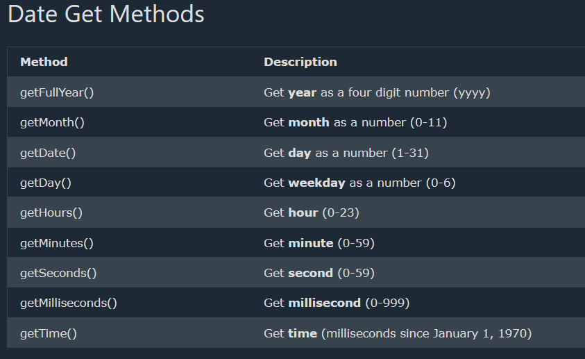

# JavaScript Commands

### 1. Getting the Date 

In JavaScript, date objects are created with **new Date()**

**new Date()** returns a date object with the current date and time.

``` javascript
 const date = new Date();
```
---

### 2. Date Get Methods
``` javascript
 const date = new Date().getFullYear();
```


---

